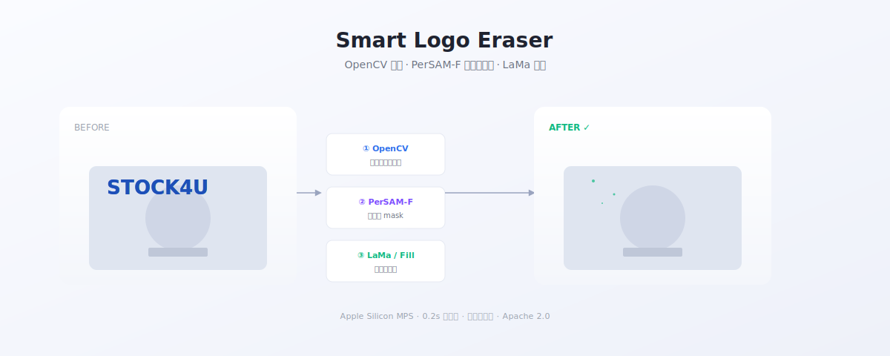

# Smart Logo Eraser

> 跨平台批量擦除图片中的 logo / 水印 — 基于 OpenCV 模板匹配 + PerSAM-F 像素级分割 + IOPaint LaMa 修复

把一个 logo 在一张样图上框一次，自动定位并精准擦除整批图片中的同款 logo。**Mac / Windows** 桌面端。



---

## ⏱ 5 秒上手

仓库自带两组合成示例素材（位于 [`examples/`](./examples/)），跑通流程不需要自己找带水印的图：

```bash
git clone https://github.com/awch-D/smart-logo-eraser.git
cd smart-logo-eraser
python3.11 -m venv .venv && source .venv/bin/activate
pip install -r requirements.txt

# 启动桌面应用
cd app && python desktop.py
```

应用打开后，在右侧 ④ 批量处理卡片顶部下拉里选「电商产品图 · STOCK4U」或「风光摄影 · PHOTOMARK」，点 **「试试示例素材」**，再点 **「开始批量擦除」**，结果直接出现在下方网格。

> 如果 `examples/` 是空的（极少数情况下被忽略），可以重新生成：`python scripts/make_examples.py`

---

## 为什么需要这个工具

电商图、爬虫数据集、文档资料里经常带有产品/视频源站的 logo 水印。
现有方案各有短板：

| 方案 | 短板 |
| --- | --- |
| 手工 Photoshop | 慢，无法批量 |
| 模板匹配 + 矩形遮罩 | 不同图片中 logo 尺寸不一致，固定 padding 必然漏底或多盖 |
| 端到端 Watermark Removal 模型 | 模型只认它训练时见过的水印样式 |
| Cleanup.pictures 等在线服务 | 隐私问题，量大要付费 |

本工具的核心思路：**让人来"教"一次（在样图上框出 logo），机器在所有图里精准复现这一次擦除**。

---

## 核心特性

- 🎯 **PerSAM-F 像素级分割**：模板匹配只给矩形 bbox，PerSAM 把它转成紧贴 logo 字母轮廓的像素 mask，自适应每张图里 logo 的实际大小，不再需要手调 padding
- 🧰 **OpenCV 多尺度模板匹配**：模板匹配负责快速定位（毫秒级），SAM 负责精确分割，分工明确
- 📚 **模板库**：保存任意多个 logo 模板，单图中可同时擦除多个不同 logo
- 🎨 **两种擦除模式**：
  - `fill` 颜色覆盖（推荐用于纯色背景，瞬时）
  - `iopaint` LaMa 修复（推荐用于复杂背景，每张 1-3s）
- 📦 **按需下载高精度模式依赖**：安装包默认不带 torch，避免 1.5GB 的体积负担。首次勾选「高精度模式」时弹窗下载 ~600MB 依赖到 `~/.logo_eraser/runtime/`，结果缓存复用
- 🧪 **内置示例素材**：仓库自带 [`examples/`](./examples/)（2 组合成图，1 个模板 + 3 张批量图），桌面应用里一键加载即可跑通完整流程
- 🍎 **Apple Silicon 加速**：通过 MPS 后端跑 MobileSAM，首张 < 1s 加载，后续每张 0.2s
- 🖥️ **跨平台桌面应用**：Flask + pywebview，单文件可执行，无需用户装 Python

---

## 技术栈

```
┌────────────────────────────────────────────────────┐
│                  Frontend (Canvas)                 │
│   框选 / 平移 / 缩放 / 吸管取色 / 模板库            │
└──────────────────────┬─────────────────────────────┘
                       │ REST + JSON
┌──────────────────────▼─────────────────────────────┐
│                 Flask Backend                       │
│  ┌──────────────┐  ┌──────────────┐ ┌────────────┐ │
│  │   OpenCV     │  │  PerSAM-F    │ │  IOPaint   │ │
│  │ matchTemplate│→ │ + MobileSAM  │→│   LaMa     │ │
│  │  (定位 bbox) │  │ (像素 mask)  │ │  (修复)    │ │
│  └──────────────┘  └──────────────┘ └────────────┘ │
└────────────────────────────────────────────────────┘
            ▲                  ▲
            │                  │
        模板库 JSON      MobileSAM 38MB
        本地持久化       (vendored)
```

---

## 安装

需要 Python 3.10+。

### macOS (Apple Silicon 推荐)

```bash
git clone https://github.com/awch-D/smart-logo-eraser.git
cd smart-logo-eraser

# 使用 uv 或者 venv 都可以
python3.11 -m venv .venv
source .venv/bin/activate
pip install -r requirements.txt
```

### macOS (Intel) / Linux / Windows

需要先按 [PyTorch 官网](https://pytorch.org/get-started/locally/) 选择对应的 torch 安装方式（CUDA / CPU-only），然后再 `pip install -r requirements.txt`。

### 验证安装

```bash
cd app
python -c "from server import app; from persam_engine import PerSamEngine; print('OK')"
```

---

## 使用

### 桌面应用

```bash
cd app
python desktop.py
```

应用会启动一个原生窗口（macOS 用 cocoa，Windows 用 edgechromium）。

工作流：

1. **上传样图** → 在 Canvas 上框选要擦除的 logo → 保存到模板库
2. 选择 1 个或多个模板（多模板适用于同批图含多种 logo）
3. **批量上传待处理图片**
4. （可选）勾选 **"高精度模式 (PerSAM-F)"** — 强烈推荐
5. 点击"开始批量擦除"，结果会在下方网格展示，点击图片可放大查看

### 命令行批处理（可选）

仓库里也带了一个独立的 CLI 脚本（不依赖桌面 UI），适合 CI/服务器场景：

```bash
python scripts/batch_remove_logo.py \
    --template path/to/logo.png \
    --input-dir path/to/images/ \
    --output-dir path/to/output/ \
    --mode fill
```

---

## 打包成安装包

仓库内附 PyInstaller spec：

```bash
cd app
pip install pyinstaller
pyinstaller logo_eraser.spec
```

产物：

- macOS：`dist/Logo Eraser.app`
- Windows：`dist/Logo Eraser/Logo Eraser.exe`

注意：默认 spec 把 torch / iopaint / timm 都排除在外，最终 lite 安装包体积约 80MB。这是为了让安装包尽可能小，但 PerSAM 高精度模式依赖这些组件。
应用启动后，用户首次勾选「高精度模式」时，会弹出 runtime 下载弹窗，自动把 ~600MB 的 torch + MobileSAM 权重下载到 `~/.logo_eraser/runtime/`，下次启动直接复用。

如果你想做"all-in-one"版本（一个包就直接能跑高精度模式），把 spec 中的 `excludes` 列表里的 `torch / torchvision / iopaint / timm / einops` 五项去掉即可（最终安装包会增大到约 1.5GB）。

---

## 项目结构

```
smart-logo-eraser/
├── LICENSE                       # Apache 2.0
├── README.md
├── ROADMAP.md                    # 产品完善路线图
├── todos.md                      # 可执行的逐项 todos
├── requirements.txt
├── assets/
│   └── hero.svg                  # README 顶部示意图
├── examples/                     # 内置示例素材（合成，可一键加载）
│   ├── README.md
│   ├── stock4u/                  # 电商产品图 · STOCK4U
│   │   ├── meta.json
│   │   ├── template.png
│   │   ├── template.box.json
│   │   └── batch/01.png 02.png 03.png
│   └── photomark/                # 风光摄影 · © PHOTOMARK
├── app/                          # 桌面应用主体
│   ├── desktop.py                # pywebview 启动入口
│   ├── server.py                 # Flask backend + API
│   ├── runtime.py                # 高精度模式 runtime 按需下载（方案 A）
│   ├── persam_engine.py          # PerSAM-F 引擎封装
│   ├── logo_eraser.spec          # PyInstaller 打包配置（onedir）
│   ├── static/                   # 前端 CSS/JS
│   ├── templates/                # HTML 模板
│   └── vendor/
│       └── personalize_sam/      # PerSAM 源码 + MobileSAM 权重 (~40MB)
│           ├── per_segment_anything/
│           └── weights/mobile_sam.pt
└── scripts/
    ├── make_examples.py          # 合成示例素材的脚本
    └── batch_remove_logo.py      # 独立 CLI 批处理（无 UI）
```

运行时数据（用户上传 / 处理结果 / 模板库）存储位置：

- 开发模式：`app/uploads/`、`app/outputs/`、`app/sessions/`、`app/templates.json`
- 打包后：`~/.logo_eraser/`（通过 `LOGOERASER_DATA` 环境变量覆盖）

---

## 工作原理 — 为什么 PerSAM-F 比 padding 更准

模板匹配返回的是矩形 bbox。在不同尺寸的图里，同一个 logo 的实际像素大小不一样：

- 模板高 33px，但大图里 logo 抗锯齿光晕一起算实际高 40px
- 固定 `pad-bottom = -9` 在大图上漏底，在小图上误擦
- 即使用百分比 padding，矩形遮罩永远是矩形，遇到不规则 logo 也会有缝隙

PerSAM-F 走的路：

1. 用户在样图上框一次 logo → 编码成"参考特征"（一次性，缓存在内存）
2. 模板匹配在目标图上定位 bbox → 作为 SAM 的 box prompt
3. PerSAM 输出像素级 mask（紧贴字母轮廓）
4. 对 mask 做一次小尺度 dilate（吸收抗锯齿光晕）
5. mask 喂给颜色填充或 LaMa 修复

效果：
- mask 像素数比矩形少 ~23%，但同时把光晕全吃掉
- 不同尺寸、不同变形（含字母歪斜）的 logo 都能精准擦
- 单图 ~0.2s（MPS），CPU 也能跑

---

## 许可

[Apache 2.0](./LICENSE)

本项目包含以下第三方代码：

- [PerSAM (Personalize-SAM)](https://github.com/ZrrSkywalker/Personalize-SAM) — MIT
- [Segment Anything](https://github.com/facebookresearch/segment-anything) — Apache 2.0
- [MobileSAM](https://github.com/ChaoningZhang/MobileSAM) — Apache 2.0
- [IOPaint](https://github.com/Sanster/IOPaint) — Apache 2.0

vendor 目录下保留了对应仓库的 LICENSE 文件。

---

## 致谢

- [Renrui Zhang et al.](https://arxiv.org/abs/2305.03048) — *Personalize Segment Anything Model with One Shot* (ICLR 2024)
- [Meta Segment Anything](https://segment-anything.com/) — 改变了图像分割工程实践的开放模型
- [IOPaint](https://github.com/Sanster/IOPaint) — 把 LaMa 工程化，让本地擦除成为可能
